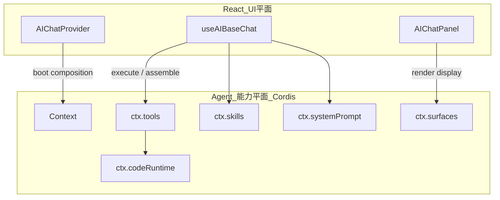

# 01 — 插件内核（Cordis）

> 对照 DeepSeek Harness 的 Cordis 组合式插件运行时；**用官方 `cordis`（MIT）**，不 vendor Harness 整仓。

---

## 1. 目标

把 Agent **能力平面**做成可组合、可卸载的插件图：

- EADAF 宿主挂载数据底座相关 Tool / Skill / Surface
- 业务系统挂载自己的插件包，复用同一内核
- 页面/应用 dispose 时自动撤销注册（effect-bound）

**非目标**：把整个 React SPA 改成 Cordis 应用；不引入 bash / 文件沙箱 / HMR 全套开发态作为产品默认能力。

---

## 2. 架构：双平面



- **React 平面**：布局、会话 UI、气泡、用户输入、`sendMockUserMessage`
- **Cordis 平面**：能力注册、校验、执行管线、提示词组装、展示意图、代码运行时

`useAIBaseChat` 在 MS1 先作为 `ctx.agentLoop` 的适配层；MS4+ 再把散装 `let` 状态收拢进 turn-scoped 容器。

---

## 3. 核心服务表

| 服务 | 职责 | 现状对应 | 目标 |
|------|------|----------|------|
| `ctx.tools` | `defineTool` 注册、pre-execute 校验、execute、post-execute | `functionRegistry` + `toolManifest` | 统一注册表 + 校验管线 |
| `ctx.skills` | catalog / `get(body)` / Provider 分层 | `skillLoader` 全文拼接 | Catalog/Body 分离 |
| `ctx.systemPrompt` | section 组装（协议 / 目录 / 当前页正文 / 路由） | `buildCombinedSystemPrompt` | 分 section + 预算 |
| `ctx.surfaces` | `presentCall` / `presentResult` → UI slot | InvocationCard + presentation 清单 | 见 [05](./05-展示协议.md) |
| `ctx.codeRuntime` | JS Worker / 后端 JS vm / 后端 Python | 缺失（仅 API handler 有 vm） | 见 [04](./04-代码运行时.md) |
| `ctx.agentLoop` | turn / step / tool 并发 / 终止 | `useAIBaseChat` ~1200 行 | 逐步迁出 |

TypeScript 通过 declaration merging 扩展 `Context` 接口；插件用 `inject: ['tools','skills']` 声明硬依赖。

---

## 4. 插件形态

三种入口（与 Cordis / Harness 一致）：

```ts
// 1) 函数插件
export const name = 'eadaf-bizdata-tools'
export const inject = ['tools', 'skills']
export function apply(ctx: Context) {
  ctx.tools.register(defineTool({ /* ... */ }))
}

// 2) 对象插件
export default { name: '...', inject: ['tools'], apply(ctx) { /* ... */ } }

// 3) Service 类
class ToolsService extends Service {
  static inject = ['systemPrompt']
  constructor(ctx: Context) {
    super(ctx, 'tools')
  }
}
```

**注册即 effect**：`ctx.tools.register(...)` 返回 disposer；Fiber 卸载时逆序清理。页面离开 / 应用切换不应泄漏全局 handler。

---

## 5. Composition（组合清单）

### 5.1 EADAF 宿主

替代一次性全局注册组件 [`AIChatClientToolsRegistrar`](../../../frontend/src/components/AIChatClientToolsRegistrar/index.tsx)：

```text
host.composition.ts（或 cordis.yml 等价物）
  - @eadaf/ai-base/plugins/core-tools      # update_plan / task_complete / ask_user / navigate / skill
  - @eadaf/ai-base/plugins/system-prompt
  - @eadaf/ai-base/plugins/surfaces
  - eadaf-host/bizdata
  - eadaf-host/apiservice
  - eadaf-host/metrics
  - eadaf-host/uac
  - eadaf-host/materialization
  - eadaf-host/collection-pipeline
  - eadaf-host/aibase-admin
  - （可选）code-runtime-js / code-runtime-python
```

在 `AIChatProvider` 启动时 `boot(composition)`；在 Provider unmount 时 `dispose()`。

### 5.2 业务系统插件包

```text
@fmms/ai-pack
  apply(ctx):
    ctx.skills.registerProvider(...)   # 或注册静态 Skill 摘要
    ctx.tools.register(defineTool(...))
    ctx.surfaces.register('workorder_table', WorkOrderTable)
```

宿主在带 `applicationId` 的 Provider 中 `ctx.plugin(fmmsPack)`。详见 [08-多应用扩展](./08-多应用扩展.md)。

### 5.3 Scope 隔离

- 页面 `AIChatPageScope` / `fallbackSkillSlugs` 继续收窄**模型可见** Skill/Tool 池
- Cordis `isolate` 可用于「不同 Agent preset」；业务侧第一阶段可用「可见性过滤」代替深 isolate

---

## 6. 工具执行管线（插件可拦截）

```text
tool/call
  → tools/pre-execute（waterfall：参数校验 / 权限 / 危险操作审批）
  → execute(handler)
  → tools/post-execute
  → normalize envelope + display
  → surfaces.presentResult → UI
  → serialize for model context（短文本 + agentHint）
```

与现有 `executeToolWithEnvelope` / `normalizeToolResult` 对齐：信封保留；在 pre-execute 插入 Schema 校验；在 post-execute 补默认 `display`。

---

## 7. 权威源调整（相对旧重设计方案）

旧方案倾向「DB `parameters_schema` 为权威 + codegen」。在插件化前提下调整为：

| 层 | 权威 | 说明 |
|----|------|------|
| **运行时** schema / handler / present | **插件代码**（`defineTool`） | 业务包自包含，可单测 |
| **治理** 可见性 / Skill↔Tool 授权 / 启停 | **DB** | 管理面 CRUD、按 application 过滤 |
| **Skill 正文** | Git Markdown（目标）或 DB `content_markdown`（过渡） | 见 [02](./02-Skill按需加载.md) |

启动期做「DB 已授权 tool 名 ⊆ 已注册 tool 名」一致性校验；漂移则 warn，不再静默用本地覆盖掩盖 DB 过时 schema。

---

## 8. 迁移步骤（对应 MS1）

1. 在 `@eadaf/ai-base` 引入 `cordis`，创建 `createAgentContext()`
2. 用 adapter 把现有 `registerFunctionCall` 桥接到 `ctx.tools.register`
3. 把 `AIChatClientToolsRegistrar` 各 `register*Tools` 改成 host 插件包的 `apply`
4. Provider 生命周期绑定 boot/dispose
5. 再迁 `skillLoader` → `ctx.skills`、prompt 组装 → `ctx.systemPrompt`

每一步保持对外 API（`sendMockUserMessage`、`registerFunctionCall` 兼容层）至少一个版本周期。

---

## 9. 明确不照搬

- Harness 的 bash / Seatbelt / Landlock / AGENTS.md 文件发现作为核心隔离
- 把 `run_code` 作为默认唯一可见 tool（Code Mode only）
- 整仓 HMR 产品化（开发态可选，非业务默认）
