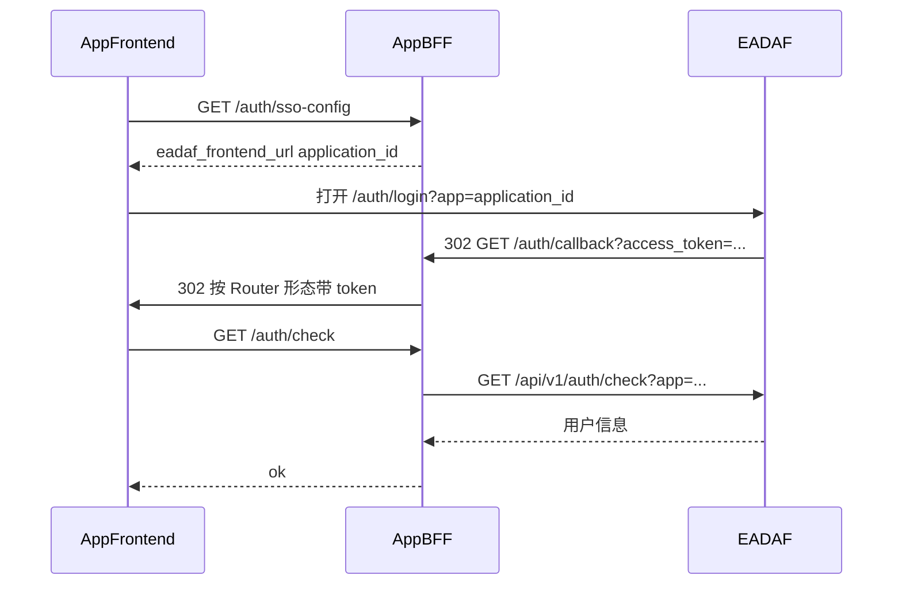

# EADAF 用户 SSO 接入指南

> 面向外部应用（含 Electron / Web + BFF）对接 EADAF **用户单点登录**。  
> 调用业务 DataAPI / 内置 API 请另见 [外部应用接入指南](./external-app-integration-guide.md)（应用 Token）。  
> 本文为 SSO 唯一权威说明；旧 `backend/Documents/SSO*.md` 已废弃。

---

## 1. 两种令牌（务必分清）

| 令牌 | 如何获得 | 用途 | 密钥 |
|------|----------|------|------|
| **用户 SSO JWT** | 用户在 EADAF `/auth/login?app={application_id}` 登录后回调下发 | 标识**终端用户**；业务侧会话、`/auth/check` | 应用统一密钥（见 §6） |
| **应用 API Token** | `POST /api/v1/applications/token`（`application_id` + `app_secret`） | 服务端调 DataAPI / 内置 API | 同一 `app_secret`，但签发的是 `type=application` 令牌 |

- `app_secret` **只保存在应用服务端**，绝不能下发到前端、写进 Git 或塞进 URL。
- 应用 Token **不能**代替用户 SSO JWT；用户 JWT **不能**当作应用 Token 调受保护的应用域 API。

---

## 2. EADAF 管理台配置

1. 登录 EADAF 管理后台 → **三方应用 / 应用**
2. 打开目标应用的 **SSO**
3. 开启 **启用 SSO**
4. 填写：
   - **重定向 URI（`redirect_uri`）**：必须是 **BFF** 回调地址，不要填前端页面地址（见 §3）
   - **跳转模式（`redirect_mode`）**：`POST_REDIRECT`（平台默认）或 `HEADER_REDIRECT`
5. 在 **密钥管理** 中生成应用统一密钥（同步为 API `app_secret` / SSO `client_secret`）
6. 保存

只读信息（如有展示）：`client_id`（应用 code）、`issuer`（当前 EADAF origin）等，一般无需业务侧手填。

### 跳转模式

| 值 | 行为 | 适用 |
|----|------|------|
| `POST_REDIRECT`（平台默认） | 浏览器对 `redirect_uri` **表单 POST**（body 含 `access_token` 等） | 必须有 BFF 接 POST |
| `HEADER_REDIRECT`（对接推荐） | **302** 到 `redirect_uri`，token 在 **query** | BFF 用 GET 收参，再 302 到前端 |

Electron / 典型 Web+BFF：**推荐在应用 SSO 配置里选 `HEADER_REDIRECT`**，与 BFF `GET /auth/callback` 一致。

---

## 3. 回调地址填谁

EADAF 应用里配置的 `redirect_uri` **必须是 BFF 地址**，不是前端页面地址。

| | 示例 |
|--|------|
| 正确 | `http://localhost:5171/auth/callback`（BFF） |
| 错误 | `http://localhost:5173/auth/callback`（前端直收） |

推荐链路：

```
用户打开业务前端
  → 跳转 EADAF /auth/login?app={application_id}
  → 登录成功
  → HEADER_REDIRECT / POST 到 BFF /auth/callback（带 access_token 等）
  → BFF 再 302 到前端回调页并带上 token（格式见 §4）
```

`redirect_mode` 必须与 BFF 实现一致。

---

## 4. 前端路由形态决定「BFF 二次跳转」格式

BFF 转发前端时，必须按前端 Router 选型拼 URL，否则会出现「有时登录成功又回到登录页」：

| 前端路由 | BFF 应 302 到 |
|----------|----------------|
| HashRouter（Electron 常见） | `{FRONTEND_URL}/#/auth/callback?token=...` |
| BrowserRouter（纯 Web） | `{FRONTEND_URL}/auth/callback?token=...` |

禁止对 HashRouter 应用只跳 `http://host/auth/callback?token=...`（无 hash）：React 路由匹配不到回调页，token 不会写入，随后被鉴权守卫送回登录页。

若历史已存在 pathname 回调，前端可在启动时兜底改写为 `/#/auth/callback?...`，但**契约上应以 BFF 直接发对格式为准**。

---

## 5. 回调查询参数约定

### 5.1 EADAF → BFF

由 `redirect_mode` 决定传递方式（query 或 POST body），字段名一致：

| 字段 | 说明 |
|------|------|
| `access_token` | 必需，用户 JWT |
| `refresh_token` | 可选 |
| `token_type` | 通常 `Bearer` |
| `expires_in` | 秒数（提示值） |
| `state` | 可选，透传登录页 query |
| `user_info` | JSON 字符串（用户摘要） |
| `verify` | JSON（`timestamp` / `public_secret` 等，可选校验） |
| `idp` | POST 模式下常见，如 `EADAF` |

### 5.2 BFF → 前端（建议统一）

| 参数 | 说明 |
|------|------|
| `token`（或兼容 `access_token`） | 必需，用户 JWT |
| `refresh_token` | 可选 |
| `user_info` | 可选；建议 BFF **裁剪**为 `user_id` / `username` / `name` / `avatar` / `department_id` 等，避免 URL 过长导致 token 被截断 |

前端回调页应同时兼容 `token` / `access_token`。

---

## 6. 验签密钥与 `/auth/check`

### 6.1 应用统一密钥（替代旧「签名盐」）

验签密钥解析优先级（EADAF 服务端）：

1. `sso_config.client_secret`
2. `api_connect_config.app_secret`
3. 旧版 `sso_config.salt`（仅兼容历史数据）

BFF 本地 `jwt.verify` 使用的密钥必须与上述应用密钥**完全一致**（通常配置为环境变量，例如 `SSO_JWT_SECRET` / `APP_SECRET`，名称自定）。  
旧文档中的 `SSO_JWT_SALT` /「签名盐值」已过时，请勿再按独立 salt 字段对接。

### 6.2 `/auth/check` 推荐策略（BFF）

1. **优先请求 EADAF**：  
   `GET {eadaf}/api/v1/auth/check?app={application_id}`  
   Header：`Authorization: Bearer <user_jwt>`
2. EADAF 不可达或非明确拒绝时，再 `jwt.verify(应用统一密钥)` / `jwt.decode` 本地回退
3. 仅当明确 **401 / 无效 token** 时清理本地登录态；网络抖动不要立刻清 token 并踢回登录页

登录时 EADAF 前端会把 URL 中的 `app` 作为 `application_id` 传给 `POST /api/v1/auth/login`，从而用应用密钥签发用户 JWT，与 `check?app=` 一致。

---

## 7. 应用侧必备接口（BFF 自建）

以下路径是**业务 BFF 约定**，不是 EADAF 内置路由。

| 接口 | 用途 |
|------|------|
| `GET /auth/sso-config` | 返回 `eadaf_frontend_url`、`application_id`、`callback_url`、`redirect_mode` 等（可免登录） |
| `GET` 或 `POST /auth/callback` | 接 EADAF 回调；与应用配置的 `redirect_mode` 一致 |
| `GET /auth/check` | 校验用户 JWT（见 §6） |
| `GET /auth/me` | 可选，返回当前用户声明 |
| `POST /auth/logout` | 可选；用户态清理由前端完成即可 |

前端登录入口推荐：

```text
{eadaf_frontend_url}/auth/login?app={application_id}
```

EADAF 侧可公开拉取的配置（跳转用，非完整密钥）：

```http
GET {eadaf}/api/v1/applications-sso/{application_id}
```

返回含 `redirect_uri`、`redirect_mode`、`currentTimestamp`、`secret`（回调校验用 hash）等，**不会**下发 `app_secret`。

---

## 8. 前端鉴权守卫注意点

1. **React StrictMode** 下回调 `useEffect` 可能双跑：第二次可能已无 query。须用 `useRef` 保证只处理一次；若本地**已有** token，应直接进业务页，而不是报「缺少 token」并踢回登录。
2. 不要把 `/login`、`/auth/callback` 记成「登录后回跳地址」。
3. 调用 `/auth/check` 时，不要走「HTTP 401 → 立刻 `clearToken` + 强制跳登录」的通用 API 客户端逻辑；仅明确无效 token 再清登录态。否则会出现「刚登录成功又被踢回登录页」。

---

## 9. 联调检查清单

- [ ] EADAF 应用 SSO 已启用，`redirect_uri` = BFF `/auth/callback`
- [ ] `redirect_mode` 与 BFF 一致（推荐 `HEADER_REDIRECT`）
- [ ] 已在「密钥管理」生成统一密钥；BFF 验签密钥与之一致
- [ ] BFF → 前端二次跳转格式匹配 HashRouter / BrowserRouter
- [ ] 浏览器 / Electron 实际落地 URL 中可见 `token=`（或 `access_token=`），且前端回调页被路由命中
- [ ] 登录后进入业务首页，而不是再次 `/login`
- [ ] DevTools：本地已有用户 token；随后业务 API 带 `Authorization: Bearer ...`
- [ ] BFF `check` 使用 `?app={application_id}`（或本地同一密钥验签）

---

## 10. 常见故障速查

| 现象 | 优先排查 |
|------|----------|
| 登录后又回登录页 | Hash 回调格式错误；StrictMode 双跑；check 误清 token；回跳路径写成了 `/login` |
| 回调 400「缺少 token」 | `redirect_mode` / 参数名与 BFF 不一致（EADAF 下发的是 `access_token`） |
| check 总是 401 | 验签密钥不一致；未带 `app={application_id}` 调 EADAF check；登录未走 SSO（未传 `application_id`）导致密钥不匹配 |
| DataAPI 403、登录却正常 | 应用 Token / 域授权问题，与 SSO 用户 JWT 无关 |
| URL 超长、偶发丢参 | `user_info` 未裁剪；改用 POST 模式或 BFF 会话存 token |
| POST 回调前端收不到 | POST 必须由 BFF 接；纯前端页面无法可靠读 body |

---

## 11. EADAF API 速查

### 11.1 SSO 登录入口（浏览器）

```text
GET {eadaf_frontend}/auth/login?app={application_id}
```

可选透传：`state`、`redirect`（仅管理台场景；业务 SSO 以应用 `redirect_uri` 为准）。

### 11.2 登录（EADAF 前端调用；业务一般不直连）

```http
POST {eadaf}/api/v1/auth/login
Content-Type: application/json

{
  "username": "...",
  "password": "...",
  "application_id": "<UUID>"
}
```

提供且应用已启用 SSO 时：用应用统一密钥签发 `token` / `refresh_token`，并可能在 `data.sso` 中带回配置摘要。

### 11.3 校验用户 JWT

```http
GET {eadaf}/api/v1/auth/check?app={application_id}
Authorization: Bearer {user_jwt}
```

### 11.4 拉取公开 SSO 跳转信息

```http
GET {eadaf}/api/v1/applications-sso/{application_id}
```

### 11.5 应用 API Token（与用户 SSO 无关）

```http
POST {eadaf}/api/v1/applications/token
Content-Type: application/json

{
  "application_id": "<UUID>",
  "app_secret": "<密钥>"
}
```

详见 [外部应用接入指南](./external-app-integration-guide.md)。

---

## 12. 时序（推荐 HEADER_REDIRECT）



---

> **文档版本**：2026-08-09  
> **适用**：当前 EADAF 开发版  
> **相关**：AI 调用约定见 [`docs/eadaf-api-skill/SKILL.md`](./eadaf-api-skill/SKILL.md)
