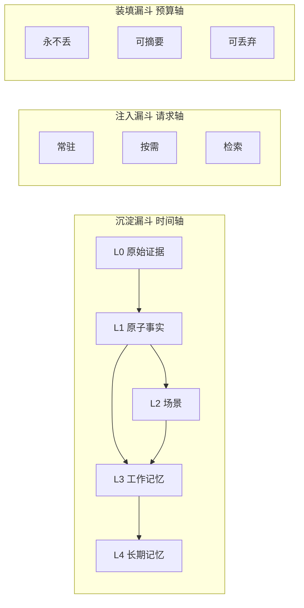
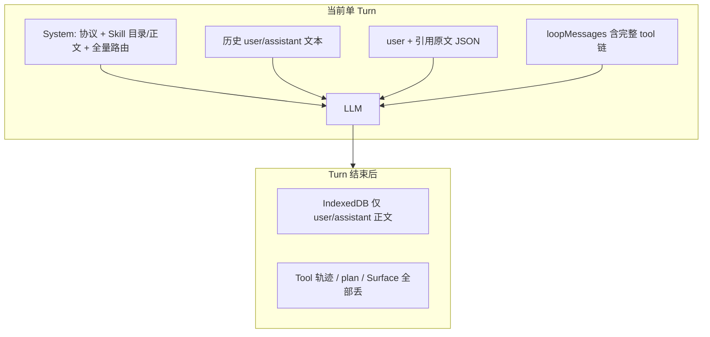

# 上下文漏斗沉淀：现状分析与分层建议

结论先说：**你的直觉是对的，但要把「漏斗」拆成三件事，否则 L3/L4 会想不清楚。**  
EADAF 今天已经有「注入漏斗」的雏形（Skill 目录 vs 正文、Tool 信封 vs display），**缺的是时间轴上的沉淀**，以及超预算时按优先级装填。现有压缩是「删旧留新」，不是漏斗。

---

## 1. 先把三个漏斗分开

「上下文管理」经常被混成一件事。科学上应拆成三条轴：



| 漏斗 | 回答的问题 | 现在 ai-base 做了什么 |
|---|---|---|
| **沉淀** | 信息如何从原始变成可复用知识 | 几乎没有；turn 结束 Tool 轨迹就丢 |
| **注入** | 这一轮请求该塞什么 | Skill 目录/正文分层、Surface 按需读、引用拼进 user |
| **装填** | token 不够时先砍谁 | `slice(-12)` 一刀切，任务清单也会被砍 |

L0–L4 属于**沉淀**；「常驻 / 按需 / 检索」属于**注入**；「永不丢 / 可摘要 / 可丢」属于**装填**。三套正交，不要用一层数字硬扛全部语义。

---

## 2. 建议的五层沉淀（补全你的 L3/L4）

| 层 | 名称 | 放什么 | 谁写 | 谁读进 LLM | 类比 |
|---|---|---|---|---|---|
| **L0** | 原始证据 | 用户原文、完整 Tool payload、附件、SSE 轨迹 | 运行时原样落库 | **默认不注入**；当前 turn 内除外；审计/回放/再蒸馏用 | 感官缓冲 / 日志 |
| **L1** | 原子事实 | 独立、可引用、带来源的事实：实体 id/code、写操作结果、用户选择题答案 | 规则从信封抽，必要时 LLM 抽 | 按当前场景过滤后注入，不灌全文 | 语义记忆单元 |
| **L2** | 场景 | 按「当下需求」聚合的情况：当前页、选中实体、表单关键字段、用户钉住的引用 | Surface + 引用 + L1 过滤 | **当前场景自动注入**（有预算） | 情境模型 |
| **L3** | 工作记忆 | 本会话任务态：目标、plan、约束、未完成项、成功标准、已确认决策 | `update_plan` / `task_complete` / 用户确认 | **每轮常驻，装填时永不丢** | 工作记忆 / 目标栈 |
| **L4** | 长期记忆 | 跨会话：会话摘要、项目约定、用户偏好（进模型的那种）、稳定实体别名 | 会话结束蒸馏；偏好显式写入 | 开场或主题切换时**检索注入**，不常驻全文 | 情景/程序记忆 |

L3 和 L4 的判据：

- **L3 随任务存活，任务结束可蒸馏进 L4 后清空。** 换会话、换目标就要换 L3，不能当永久档案。
- **L4 跨任务、按需取。** 永远全量塞进 system 会把漏斗堵死。

---

## 3. 对照：现在每一层实际在哪

源码主包：[AIBase_with_example/package/ai-base](AIBase_with_example/package/ai-base)。后端 `/chat/completions` 是透传网关，**不拼 messages、不做记忆**。

### 已有、且方向对的

- **注入漏斗（Skill）**：目录摘要常驻，正文按 `fallbackSkillSlugs` + 框架 Skill 预取，其余走 `skill` Tool。[skillLoader.ts](AIBase_with_example/package/ai-base/src/registry/skillLoader.ts) `loadChatSkillContext` / `buildCombinedSystemPrompt`。
- **Tool 的 UI/模型分流**：`display` 不进模型；`toToolResponseContextView` 才进上下文。[normalizeToolResult.ts](AIBase_with_example/package/ai-base/src/utils/normalizeToolResult.ts)。
- **结果预算**：默认 8000 字符；列表形按条裁，保留 total/hint。[toolResultBudget.ts](AIBase_with_example/package/ai-base/src/utils/toolResultBudget.ts)。
- **同轮批量聚合**：多条同名 Tool 压成计数摘要。[aggregateToolResults.ts](AIBase_with_example/package/ai-base/src/utils/aggregateToolResults.ts)。
- **L2 雏形**：`useAISurface` + `aibase_read_surfaces`（按需，不自动注入）。
- **L3 雏形**：`update_plan` / `agentPlanState`，但**只活在当前 turn**，下一句用户话就没了。[agentPlanState.ts](AIBase_with_example/package/ai-base/src/registry/agentPlanState.ts)。

### 缺的、或做反了的



| 层 | 现状 | 问题 |
|---|---|---|
| L0 | 只存在于本 turn 的 `loopMessages`；持久化时 [sanitizeMessagesForPersist](AIBase_with_example/package/ai-base/src/storage/chatHistoryDb.ts) 丢掉 tool 消息 | 无法回放、无法再蒸馏；下一轮模型看不到「刚才 Tool 到底改了什么」 |
| L1 | 无 | 只有裁短的 JSON，不是事实；列表截断后模型甚至可能误读 |
| L2 | Surface 要模型主动 read；引用是 `JSON.stringify` 整包塞进 user 文本 | 场景不稳定：忘了调 tool 就盲；引用是噪音不是聚合 |
| L3 | plan 模块级单例、turn 结束即清；compaction 会把早期约定一起 `slice` 掉 | 长任务失忆；多会话还有污染风险（已有方案 P1-3） |
| L4 | 无。localStorage 只存模型/开关等 UI 偏好，**不进 LLM** | 跨会话从零开始 |
| 装填 | [contextBudget.ts](AIBase_with_example/package/ai-base/src/chat/contextBudget.ts)：120k 字符、85% 触发、**硬留最近 12 条** | 恰好砍掉方法论里「永远保留」的 L3；已有方案 P2-1 已点名 |

另外：`getContextUsagePercent` 把 systemPrompt 算进用量，**compact 触发却只看 history 字符**，system 膨胀时不会提前压缩历史。

---

## 4. 发给模型的装填优先级（建议）

每一轮 `loopMessages` 不应再是「system + 最近 12 条 + 本轮 tool 全文」，而应按优先级装箱：

1. **永不丢（P0）**：执行协议（短）+ L3 工作记忆（goal/plan/约束）+ 当前 user 问题  
2. **当前场景（P1）**：L2 场景卡（页面、选中实体、钉住引用的**提炼**，不是原始 JSON）  
3. **本 turn 运行时**：最近 N 轮 assistant/tool（已预算裁剪的信封）  
4. **相关事实（P2）**：L1 中与当前场景/实体 id 相交的原子事实  
5. **检索（P3）**：L4 摘要、约定  
6. **可丢**：更早对话原文 → 先变成「会话摘要」再进 L4，而不是直接 delete

对应改动的第一落点仍是 `compactHistoryForApi`：从「删消息」改成「按层打包」。Skill 目录/正文策略可以保留，它已经是注入漏斗。

---

## 5. EADAF 域里 L1/L2 长什么样（避免空谈）

L1 不要做成「再调一次 LLM 写散文摘要」。优先**从已有信封规则抽取**（你们已经有 `ToolResponse`）：

```text
{ factId, type, subject: { kind, id, code? }, predicate, value, source: { turnId, tool, toolCallId }, ts }
```

典型 `type`：`entity_ref` / `mutation_result` / `user_decision` / `page_focus` / `constraint`。

L2 场景卡（每轮自动注入一小段，替代「等模型去 read_surfaces」）：

```text
scene:
  route: /bizdata/entities
  domain: bizdata
  focus: { kind: Entity, id, code, name }
  pinnedRefs: [{ type, label, id }]   # 不要整表 JSON
  formDirty: true
```

这才是「按需求聚合」：需求 = 当前页 + 当前焦点 + 用户钉住的东西。

L3 应跨 turn 写入**会话级 store**（不要模块级 `let current`），至少：`goal`、`plan[]`、`openQuestions[]`、`doneSummary`。`task_complete` 时把 L3 蒸馏成一段 L4 条目，然后清空 plan。

---

## 6. 和已有 Agent 重设计文档的关系

[docs/TODOs/AI数据底座Agent重设计方案.md](docs/TODOs/AI数据底座Agent重设计方案.md) 已写：

- 原则 3 上下文经济：注入最小化 / 结果裁剪 / **按优先级动态压缩**
- P2-1：`slice(-12)` 丢失任务清单与早期 Tool 结论
- 原则 4：状态外部化（plan/goal 应在工具可读写的载体里，而不是模型「记着」）

本次漏斗模型是把上述原则**展开成可实现的记忆分层**。不必另起炉灶；实现时应把 compaction 从「删历史」升级为「L3 常驻 + L1 沉淀 + L0 不进窗」。

---

## 7. 建议的演进顺序（确认后再做）

本次只调研、不改代码。若继续落地，建议小步：

1. **装填纠偏（收益最大）**：`compactHistoryForApi` 改为保留 L3 投影（plan/goal 文本块）+ 最近对话；被裁部分生成一条结构化「已压缩摘要」而不是一句英文 notice。plan 提升为会话级，而不是 turn 级单例。  
2. **L2 自动注入**：把当前 Surface 快照做成有预算的 scene card 写入 system 或 user 前缀；`read_surfaces` 改为深查，而不是唯一入口。引用改为 `{type,label,id}` + L1 指针，禁止整包 JSON。  
3. **L1 规则抽取**：写成功的 Tool 信封抽出 `mutation_result` / `entity_ref`，跨 turn 带进下一轮（有条数上限）。  
4. **L0 可回放**：IndexedDB 或后端审计保留 tool 轨迹（可截断），与「发给模型的视图」分离。  
5. **L4**：会话结束把 L3+L1 蒸馏成短摘要；先本地，再考虑服务端。不要一上来上向量库。

刻意不做的：把记忆编排搬到 backend `chatCompletions`（当前网关职责清晰）；不要用 LLM 对每一条 Tool 做散文摘要（贵、慢、不可引用）。
