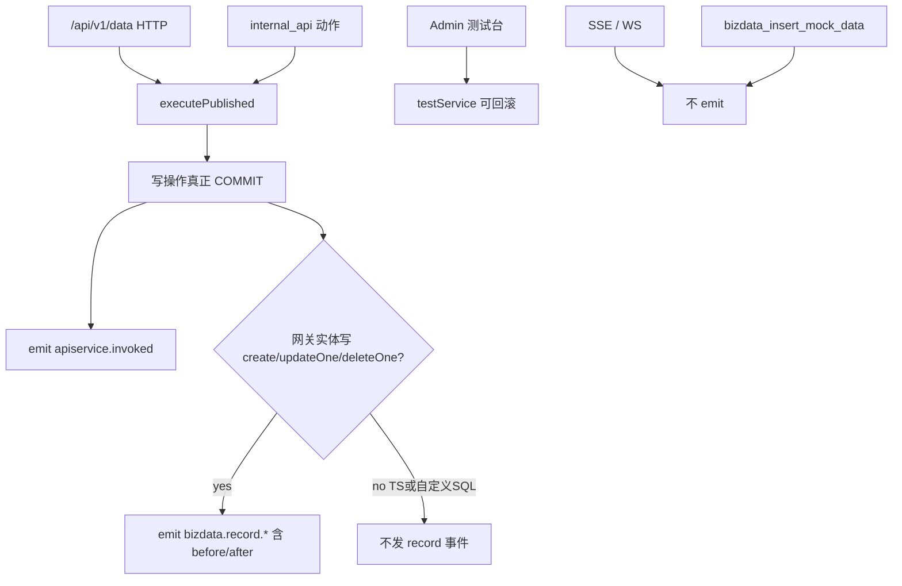

# 钩子管理（Hook Center）方案计划 — Review 修订稿

> Review 对象：[docs/钩子管理方案计划.md](钩子管理方案计划.md)  
> 核查基准：outbound webhook 全链路、`apiServiceInvokeService` / `apiServiceExecutionService` / `sqlDialect`、auth、metricScheduler、builtin API catalog、前端 ApiServices 样板  
> Review 日期：2026-08-31 · 方式：方案中全部事实断言逐条对照源码核查（file:line 为证）  
> 状态：**以本文为准的实施蓝本**（原文保留作历史；落地请按本文执行）

关联文档：[outbound-webhook-evolution.md](./outbound-webhook-evolution.md)（P3 路线）、[external-app-integration-guide.md](./external-app-integration-guide.md)（入站方向，互补）

---

## 0. 总评

**方向通过，不能按原文直接开工。**

核心判断全部成立：

- 演化文档 P3 门槛已满足（多触发源 + 跨模块订阅 + 异构动作），独立钩子/事件中心时机正确；
- **仅事后异步**、**统一收编 outbound webhook**、菜单挂「API 服务」分组等产品决策正确；
- 条件过滤、防循环、重试/自动停用、Run/重放、注册表缓存等「容易遗漏」清单方向对；
- AI 闭环照搬 ApiServices / OutboundWebhook 样板，符合「必须走 AI Chat」集成原则。

但核查同时发现：

1. **1 处落地前置缺陷**：生产 Data API 写路径走 `testService` 且默认事务回滚，现网 webhook 已在「可能已回滚的 preview」上触发——不先拆 `executePublished`，`bizdata.record.*` 是假事件；
2. **多处与代码不符的接线细节**（函数名、方言、SSRF、字符上限、HTTP 超时、权限 catalog 等）；
3. **若干原文自相矛盾与设计缺口**（测试是否写 Run、重放 vs 去重唯一索引、`internal_api` 如何传 depth、硬删 CASCADE、队列无深度上限、M4 漏公开文档页等）。

修订稿**保留**原文产品决策与 §1–§18 骨架，只改「怎么接到现网上」。开放问题在本文拍板，不再悬空。

---

## 1. 事实核查表（逐条）

图例：✅ 属实 · ⚠️ 属实但需补充精度 · ❌ 不属实

### 1.1 背景与现状

| # | 方案断言 | 结论 | 证据 |
|---|---|---|---|
| 1 | 当前唯一钩子能力是「提交外部 API」，仅业务 Data API HTTP 成功后外呼 | ✅ | `apiServiceInvokeService.js:92-101`（仅 `transport === 'http'` 才 `triggerByApiService`）；`outboundWebhookService.js:414-420`（`trigger_api_service_id` + `published`） |
| 2 | 外呼在业务 API 请求路径上 `await`（性能隐患） | ✅ | `apiServiceInvokeService.js:96` `await triggerFn(...)`；`outboundWebhookService.js:410-413` 注释「同步触发」 |
| 3 | 测试台 / AI mock 直写不触发 webhook | ✅ | Admin test 只调 `testService`（`apiServiceController.js:190-196`）；`bizdata_insert_mock_data` 走物化直插（`toolInvokeService.js:107-113`） |
| 4 | SSE 不触发 | ✅ | `streamPublishedSse` 无 trigger（`apiServiceInvokeService.js:106-135`） |
| 5 | 演化文档 P3 = 独立钩子中心 | ✅ | `outbound-webhook-evolution.md:73-78` |

### 1.2 触发与执行路径（关键）

| # | 方案断言 | 结论 | 证据 |
|---|---|---|---|
| 6 | 接线改 `executeCreatePg` / `executeUpdateOnePg` / `executeDeleteOnePg` | ❌ | **无此命名**。真实为 `executeCreate` / `executeUpdateOne` / `executeDeleteOne`（`apiServiceExecutionService.js:311-365`） |
| 7 | Data API 写路径仅 PostgreSQL | ❌ | `sqlDialect.js:14-28` 已支持 `postgresql` \| `mysql`；MySQL 用 insert/update+select 模拟 RETURNING |
| 8 | update 返回 before/after 是「小改」 | ⚠️ | 对外只返回 `{ item, matched }`（`:334-353`）；MySQL `updateThenSelect` 内部已有 before SELECT 但未暴露（`sqlDialect.js:276-300`）。且仅覆盖**网关实体写**，自定义写 SQL / TS Handler **无 before** |
| 9 | 登录/登出成功后加一行 `emit()` 即可 | ✅（接线） | `authController.js:203-293` 登录成功无 side-effect；logout `:442-463` 仅撤销 refresh token。但登录路径还含 SSO 分支，payload 需明确是否带 `application_id` |
| 10 | `invokePublished` 成功与失败都可发 `apiservice.invoked` | ⚠️ | 当前仅 `testService` **返回**后触发；**抛错不触发**。失败事件需显式 catch 后再 emit，原文未写清 |
| 11 | WebSocket 边界 | ❌ 原文遗漏 | WS `/api/v1/ws/data/*` 同样走 `testService`、不触发 webhook（`apiServiceWebSocket.js:48-53`），应与 SSE 并列写入边界 |

### 1.3 生产写路径与回滚（最高优先级）

| # | 方案断言 | 结论 | 证据 |
|---|---|---|---|
| 12 | 记录事件在「已发布 Data API HTTP 调用成功」后触发，数据真实落库 | ❌ | `invokePublished` 调的是 `testService`（`apiServiceInvokeService.js:85-90`）；写操作进 `runWriteTest`，`apiServiceTestAutoRollback` **默认 true**（`apiServiceExecutionService.js:163-172`、`systemService.js:46`）。**现网 webhook 已可能在回滚后的 preview 上触发** |

### 1.4 动作、沙箱、安全

| # | 方案断言 | 结论 | 证据 |
|---|---|---|---|
| 13 | 脚本超时 5s，复用 `apiServiceHandlerRuntime` vm 沙箱 | ✅ | `HANDLER_TIMEOUT_MS = 5000`；outbound transform 同为 5s（`outboundScriptRuntime.js:4`） |
| 14 | 源码上限 20000 / 输出 50000「沿用惯例」 | ❌ | 该限制在 **ai-base** `runJavaScript.ts:4-6`，**不在** backend handler。backend 无字符上限 |
| 15 | 外呼复用 `httpRequestToolService` 的私网 IP 黑名单 | ❌ | outbound 路径**无任何 SSRF**（`outboundHttpClient.js` 直接 `fetch`）。AI HTTP tool 仅拦 metadata 主机，**首次请求不拦 RFC1918**（`httpRequestToolService.js:17-21, 182-187`） |
| 16 | HTTP 超时默认 30s | ❌ | 现状固定 **10s**（`outboundHttpClient.js:5`） |
| 17 | 密钥 AES 加密、掩码、空提交保留 | ✅ | `encryption.js` + `outboundWebhookService.js:163-212` |
| 18 | `transform_script` 可作为高级选项保留 | ⚠️ | 当前**发布必填**（`outboundWebhookService.js:301-310`）。新动作可改模板为主，但迁移必须原样带走 transform |
| 19 | 管理路由挂 `auth`，按需登记 builtin catalog | ⚠️ | 同域惯例是 `authWithBuiltinApiGuard`（outbound 已挂）。但 **catalog 未登记 outbound**（`builtinApi/catalog.js` 无命中）——未命中则放行，guard 形同虚设。新钩子路由须**真登记** |

### 1.5 调度、前端、AI

| # | 方案断言 | 结论 | 证据 |
|---|---|---|---|
| 20 | cron 复用 metricScheduler：DB 驱动 + node-cron + Redis 锁 | ✅ | `metricScheduler.js:51-86`；`metricRedis.acquireRunLock`；`app.js:203-220` 启动 |
| 21 | `PAGE_LAYOUT_STANDARD.md`、FixHeaderPage、UrlSyncedProTable | ✅ | 规范存在；ApiServices 多数列定义仍内联，新页建议新建 `schema.tsx` |
| 22 | 新建 `HooksAI.tsx` wrapper | ❌ | `api_services` 仅一个 `SCOPE_WRAPPERS` 入口（`routes/index.tsx` → `ApiServicesAI`）。应在 `ApiServicesAI.tsx` 按 pathname 分支，对齐 collection-pipelines |
| 23 | 菜单权限 `api_services:manage` | ✅ | `uac-permissions-catalog-seed.sql`；`config.ts:128-132` |
| 24 | outbound 公开文档页 / application scope | ❌ 原文 M4 遗漏 | 公开页 `/public/.../outbound-webhooks`；`outbound_webhook_scope` 只管 catalog 展示。收编必须同步迁移 |

### 1.6 原文内部矛盾

| # | 矛盾 | 结论 |
|---|---|---|
| 25 | §3.7「测试不产生运行记录」vs API「写 `trigger_source=test` Run」 | 必须二选一 → **写 Run**，统计只计正式触发 |
| 26 | `UNIQUE(event_id, hook_id, attempt)` vs 重放用原 payload | 重放须**新 event_id**，否则撞唯一索引 |
| 27 | `skipped` 既表条件不匹配又表递归拦截 | 应拆 `skipped` / `suppressed` |
| 28 | `payload.after`、`{{event.after}}`、`handler(event, ctx)` 命名不一致 | 须统一信封（见 §4.3） |

---

## 2. 必须修正项（写入可实施蓝本）

### 2.1 M0 前置：拆生产执行路径（阻塞一切事件语义）



- 新增 `executePublished(serviceId, opts)`：写操作**永不**走 `runWriteTest` 回滚；读操作可复用现有执行核。
- `testService` 保留给 Admin 测试台 / AI `apiservice_run_test`（默认回滚不变）。
- `invokePublished` 与钩子 `internal_api` **只**调 `executePublished`。
- 失败路径：`executePublished` 抛错时仍 `emit('apiservice.invoked', { status: 'failed', error })`（fire-and-forget），再 rethrow 给 HTTP 层。

### 2.2 before/after 覆盖范围（诚实承诺）

| 写路径 | `bizdata.record.*` | before/after |
|---|---|---|
| 网关实体 `create` / `insertOne` | ✅ created | `after` = 新建行；无 before |
| 网关实体 `updateOne` / `findOneAndUpdate` | ✅ updated | MySQL 已有 before SELECT，改为返回；PG 更新前补一次 SELECT 或双返回 |
| 网关实体 `deleteOne` / `findOneAndDelete` | ✅ deleted | `before` = 删除前行（MySQL `selectThenDelete` 已有） |
| 自定义写 SQL | ❌ 不发 record | 仅 `apiservice.invoked` |
| TypeScript Handler 写 | ❌ 不发 record | 仅 `apiservice.invoked`（Handler SDK 仍偏 PG，不在本方案修方言） |

### 2.3 其它设计拍板

| 问题 | 修订结论 |
|---|---|
| 测试是否写 Run | **写**；`trigger_source=test\|replay`；列表成功率只计 `event\|schedule` |
| 重放 vs 去重 | 重放生成**新 event_id**；同 `event_id+hook_id+attempt` 唯一冲突 = 去重成功 |
| Run 配置快照 | 增加 `hook_version` + `action_config_snapshot`（密钥脱敏，永不写明文） |
| depth 传递 | 引入 `AsyncLocalStorage`（仓库现状无 ALS）；`internal_api` 经 `executePublished` 后由执行层 `emit`，禁止指望 HTTP invoke 层自动发 |
| 事件信封 | 见 §4.3；模板 `{{payload.after.amount}}`；脚本 `handler(event, ctx)`，`ctx.payload` 别名 |
| 删除策略 | 钩子**软删** `status=deleted`；Run **保留**（去掉 ON DELETE CASCADE） |
| 队列深度 | 全局并发 20 + 单钩子并发 3 + **队列深度上限 500**；满则 `suppressed` + 告警日志 |
| 状态拆分 | `skipped` = 条件不匹配；`suppressed` = depth≥3 / 去重 / 队列满 |
| AI Wrapper | 在 `ApiServicesAI.tsx` pathname 分支，**不**新建顶层 HooksAI |
| 管理鉴权 | `authWithBuiltinApiGuard` + **登记** `builtinApi/catalog.js` |
| SSRF | 在 `outboundHttpClient`（及新 http_request 动作）实现真实私网/metadata 拦截，不「复用」AI HTTP tool 半套策略 |
| 脚本字符限 | backend 新动作自行定义（建议源码 20000、输出 50000），勿声称「沿用 handler 惯例」 |
| HTTP 默认超时 | 新默认 **30s**（上限 60s）；迁移旧 webhook 显式保留原 10s 行为或统一文档说明变更 |
| M4 收编范围 | 管理表 + 公开 catalog + `outbound_webhook_scope` + 菜单下线 + 旧 API 只读 |
| 失败告警通道 | 第一期不做（`auto_disabled` + 列表红标） |
| `internal_api` 身份 | 第一期**系统身份**；触发者身份列二期 |
| Run 保留 | 全局 30 天且每钩子最近 1000 条；第一期不按钩子可配 |

---

## 3. 修订后完整方案（实施蓝本）

> 以下章节替代原文对应节；未点名修改处与原文意图一致。

### 3.1 背景与目标

（同原文 §1）多触发源、多动作、AI 辅助；目标用户为非专业程序员；非目标：同步拦截、脚本内 fetch、持久化队列、可视化 DAG。

**补充非目标**：第一期不对 TypeScript Handler / 自定义写 SQL 提供 `bizdata.record.*` before/after。

### 3.2 已确认的产品决策

| 决策点 | 结论 | 备注 |
|---|---|---|
| 执行语义 | **仅事后异步** | 主请求路径零 await 钩子执行 |
| 与 outbound webhook | **统一收编** | M4 最后执行；含公开文档与 application scope |
| 第一期触发源 | 登录、登出、记录增删改、API 调用、cron + 手动测试 | 验收以 Data API HTTP + 记录事件为主 |
| 菜单入口 | `/api_services/hooks` | 与「提交外部 API」「采集数据结构化」并列 |
| 生产写语义 | **M0 必须先拆** `executePublished` | 见 §2.1 |

### 3.3 能力清单（相对原文的修订）

保留原文 15 项能力，修订如下：

| # | 修订 |
|---|---|
| 2 防循环 | depth≥3 → 记 **`suppressed`**（非 skipped） |
| 7 测试 | **写 Run**，`trigger_source=test`；不计入成功率分子分母 |
| 11 before/after | 仅网关实体写；见 §2.2 |
| 新增 | 队列深度上限；Run 配置快照；事件信封统一；钩子软删 |

### 3.4 核心概念与事件信封

#### 概念模型

（同原文：Event → EventDispatcher → Hook → Action → Run）

#### 统一事件信封（单一事实源）

```ts
type HookEvent = {
  id: string;           // UUID，重放时重新生成
  type: string;         // auth.user.login | bizdata.record.updated | ...
  occurredAt: string;   // ISO
  depth: number;        // 首发 0；internal_api / 脚本引起的后续事件 +1
  payload: Record<string, unknown>;
};
```

| 场景 | 约定 |
|---|---|
| Body / 参数模板插值 | `{{payload.after.amount}}`、`{{payload.entity_code}}`（**禁止**再写 `{{event.after}}`） |
| 脚本签名 | `async function handler(event, ctx)`；业务数据用 `event.payload`；`ctx.payload` 为只读别名 |
| 条件表达式 | 沙箱绑定 `payload`（及只读 `event`）；如 `payload.after.amount > 10000` |
| Run 落库 | 存完整 `HookEvent`（含 depth）；列表/详情 JSON 树展示 |

### 3.5 事件源设计（第一期）

#### 事件目录

| 事件类型 | 触发时机 | 负载要点 |
|---|---|---|
| `auth.user.login` | 登录成功后（含 SSO 分支返回前） | `user_id`、`username`、`ip`、`user_agent`、`login_at`、可选 `application_id` |
| `auth.user.logout` | 登出成功后 | `user_id`、`username`、`logout_at` |
| `bizdata.record.created` | **网关实体写** create/insertOne 且 **已 COMMIT** | `entity_code`、`after`、`api_service_id`、`operation` |
| `bizdata.record.updated` | 网关实体写 updateOne 已 COMMIT | `entity_code`、`before`、`after`、`changed_fields[]`、`api_service_id`、`operation` |
| `bizdata.record.deleted` | 网关实体写 deleteOne 已 COMMIT | `entity_code`、`before`、`api_service_id`、`operation` |
| `apiservice.invoked` | Data API HTTP **成功或失败**完成后 | `api_service_id`、`operation`、`status`、`duration_ms`、请求/响应摘要（截断）、可选 `error` |
| `schedule.cron` | cron 到点 | `cron`、`fire_at`、`hook_id` |
| `manual.test` | 测试面板 / AI 试跑 | 用户 mock 或引用历史 payload |

完整 JSON Schema + 示例由 `GET /api/v1/automation/hooks/event-types` 下发。

#### 触发点接线

| 事件 | 接线位置 | 说明 |
|---|---|---|
| 登录/登出 | `authController.js` 成功返回前 | 纯新增 `emit()`；不阻塞响应（fire-and-forget） |
| API 调用 | `apiServiceInvokeService.invokePublished` | 改调 `executePublished`；替换 `triggerByApiService`；成功/失败均 emit `apiservice.invoked` |
| 记录增删改 | `executePublished` 内网关实体写成功后 | 仅 §2.2 表格中的 operation；携带 before/after |
| before/after | `executeUpdateOne` / `sqlDialect.updateThenSelect` 等 | 返回 `{ before, after, changed_fields }`；create/delete 对称 |
| cron | 新 `hookScheduler.js`，`app.js` 与 metricScheduler 并列 | DB 配置驱动 + node-cron + Redis 锁 |

**边界（有意为之）**：

- 记录事件**只**在已发布 Data API **HTTP + executePublished COMMIT** 路径触发；
- Admin 测试台、AI `apiservice_run_test`、`bizdata_insert_mock_data`、SSE、**WebSocket** 均不触发；
- `executable: false` 的调用：发 `apiservice.invoked`（status=failed/skipped 语义在 catalog 定义），**不发** record 事件。

### 3.6 钩子定义与条件过滤

（同原文：对象过滤 → 操作过滤 → 字段变更 → 表达式；由宽到严。）

状态机：

```
draft ──启用──▶ enabled ──禁用──▶ disabled
                   │                 │
                   ▼（连续失败达阈值）  └──启用──▶ enabled
              auto_disabled ──人工修复后启用──▶ enabled
                   │
              （软删）──▶ deleted（列表默认隐藏）
```

`auto_disabled` 与 `disabled` 均不执行；列表用醒目标签区分。

### 3.7 动作类型

#### `http_request`

- 继承 outbound 能力：Method（POST/PUT/PATCH）+ URL + Header + Body 模板插值 + 可选 transform 脚本（高级）+ 鉴权 + 响应判定规则；
- 复用并增强：`outboundHttpClient`（**补 SSRF**、可配置超时）、`outboundResponseRules`、`encryption`；
- 默认超时 **30s**（上限 60s）。

#### `internal_api`

- 选已发布 API 服务 + operation；参数 `{{payload.*}}` 插值；
- 调用 `executePublished`（系统身份）；执行层按 §2.1 发后续事件；
- 通过 ALS 继承并递增 `depth`。

#### `script`

- `async function handler(event, ctx)`；
- 运行时：泛化 `apiServiceHandlerRuntime`（vm、5s 默认超时、上限 30s）；
- DB：仅 `handlerSdk` 白名单；
- TS：`stripTypeScriptForVm` + `handlerTypeCheck`；Monaco 提供 `hookSdk.d.ts`；
- **本动作自行限制**：源码 ≤20000 字符、输出序列化 ≤50000 字符；
- `ctx`：`log()` / `logger` / `payload` 别名；第一期无网络与文件。

#### 动作公共配置

| 配置 | 默认 | 说明 |
|---|---|---|
| 超时 | 脚本 5s / HTTP 30s | 脚本上限 30s，HTTP 上限 60s |
| 失败重试 | 2 | 指数退避 1s/4s/16s… |
| 连续失败停用阈值 | 10 | → `auto_disabled` |
| 单钩子并发 | 3 | 超出排队 |
| 全局并发 | 20 | — |
| 全局队列深度 | 500 | 满 → `suppressed`，不丢弃已入队任务以外的新投递 |

### 3.8 执行引擎与可靠性

#### 异步非阻塞

- `emit()`：匹配 → 投递进程内队列（`setImmediate` + 并发闸）→ **立即返回**；
- 主请求路径**零 await** 动作执行（修正现网 webhook await）。

#### 运行状态

`success` / `failed` / `timeout` / `skipped`（条件不匹配） / `suppressed`（depth / 去重 / 队列满）

#### 重试与自动停用

（同原文：同 `run_group_id` 多 attempt；达阈值 `auto_disabled`；重新启用清零计数。）

#### 递归保护

- ALS 携带当前 `depth`；动作引起的后续 `emit` 使用 `depth+1`；
- `depth ≥ 3` → 不执行，记 `suppressed`。

#### 幂等与去重

- `UNIQUE(event_id, hook_id, attempt)`；
- 重放：新 `event_id`，`trigger_source=replay`，payload 可复制。

### 3.9 运行历史与可观测性

- 表 `automation.hook_runs`；详情含 payload 树、**配置快照**、attempt 时间线、日志；
- 重放按钮；保留 30 天且每钩子最近 1000 条；`hookScheduler` 附带清理；
- 列表聚合：最近状态、近 7 天成功率（**仅** `event|schedule`）；
- 失败告警通道第一期不做。

### 3.10 安全与权限

| 面 | 措施 |
|---|---|
| 脚本沙箱 | vm 新上下文 + 白名单 + 超时；无 require/process/fetch/文件系统 |
| DB | 仅 handlerSdk |
| 外呼密钥 | AES；掩码；空提交保留；Run/快照永不记明文 |
| SSRF | **新建**私网 + metadata 拦截于外呼客户端（首次请求即拦） |
| 权限 | `authWithBuiltinApiGuard` + catalog 登记；菜单 `api_services:manage` |
| 审计 | `created_by` / `updated_by`；test/replay/event 在 Run 可区分 |

### 3.11 性能

（同原文：内存注册表、无钩子快速返回、过滤预编译、负载摘要截断。）

补充：队列深度上限防 OOM；多实例缓存一致性第一期单实例假设，多实例前 Redis pub/sub 失效。

### 3.12 数据库设计（DDL 修订草案）

新增 schema `automation`；迁移 `backend/scripts/migrate-hook-center.sql`，挂入 `initdb.sh` 增量段。

```sql
CREATE SCHEMA IF NOT EXISTS automation;

CREATE TABLE IF NOT EXISTS automation.hooks (
    id                   UUID PRIMARY KEY DEFAULT gen_random_uuid(),
    name                 VARCHAR(255) NOT NULL,
    description          TEXT,
    status               VARCHAR(32)  NOT NULL DEFAULT 'draft',
    -- draft|enabled|disabled|auto_disabled|deleted
    event_type           VARCHAR(64)  NOT NULL,
    event_filter         JSONB        NOT NULL DEFAULT '{}'::jsonb,
    condition_expr       TEXT,
    action_type          VARCHAR(32)  NOT NULL,
    -- http_request|internal_api|script
    action_config        JSONB        NOT NULL DEFAULT '{}'::jsonb,
    failure_policy       JSONB        NOT NULL DEFAULT '{}'::jsonb,
    consecutive_failures INT          NOT NULL DEFAULT 0,
    version              INT          NOT NULL DEFAULT 1,
    created_by           VARCHAR(64),
    updated_by           VARCHAR(64),
    created_at           TIMESTAMPTZ  DEFAULT CURRENT_TIMESTAMP,
    updated_at           TIMESTAMPTZ,
    deleted_at           TIMESTAMPTZ,
    CONSTRAINT hooks_status_chk CHECK (status IN (
      'draft','enabled','disabled','auto_disabled','deleted'
    )),
    CONSTRAINT hooks_action_type_chk CHECK (action_type IN (
      'http_request','internal_api','script'
    ))
);
CREATE INDEX IF NOT EXISTS hooks_status_event_idx
  ON automation.hooks (status, event_type)
  WHERE status <> 'deleted';

CREATE TABLE IF NOT EXISTS automation.hook_runs (
    id             UUID PRIMARY KEY DEFAULT gen_random_uuid(),
    run_group_id   UUID         NOT NULL,
    hook_id        UUID         NOT NULL REFERENCES automation.hooks(id), -- 无 CASCADE
    hook_version   INT          NOT NULL,
    event_id       UUID         NOT NULL,
    event_type     VARCHAR(64)  NOT NULL,
    event_depth    INT          NOT NULL DEFAULT 0,
    trigger_source VARCHAR(32)  NOT NULL DEFAULT 'event',
    -- event|test|replay|schedule
    payload        JSONB        NOT NULL,  -- 完整 HookEvent
    action_config_snapshot JSONB,          -- 脱敏后的动作配置快照
    status         VARCHAR(32)  NOT NULL,
    -- success|failed|timeout|skipped|suppressed
    attempt        INT          NOT NULL DEFAULT 1,
    duration_ms    INT,
    error          TEXT,
    output         JSONB,
    logs           JSONB,
    started_at     TIMESTAMPTZ  NOT NULL DEFAULT CURRENT_TIMESTAMP,
    finished_at    TIMESTAMPTZ
);
CREATE INDEX IF NOT EXISTS hook_runs_hook_time_idx
  ON automation.hook_runs (hook_id, started_at DESC);
CREATE INDEX IF NOT EXISTS hook_runs_status_idx
  ON automation.hook_runs (status, started_at DESC);
CREATE UNIQUE INDEX IF NOT EXISTS hook_runs_dedup_idx
  ON automation.hook_runs (event_id, hook_id, attempt);
```

Sequelize 模型：`automation_hook.js`、`automation_hook_run.js`，注册进 `models/index.js`。

### 3.13 后端结构与 API

#### 目录 `backend/src/services/automation/`

| 文件 | 职责 |
|---|---|
| `eventCatalog.js` | 事件目录单一事实源 |
| `eventContext.js` | AsyncLocalStorage：depth / 根 event_id |
| `eventDispatcher.js` | `emit`：匹配 → 队列；depth / 去重 / 队列深度 |
| `hookRegistryCache.js` | 启动加载、CRUD 失效、过滤预编译 |
| `hookExecutor.js` | 三动作、重试、超时、并发闸、写 Run、自动停用 |
| `actions/httpRequestAction.js` | 外呼 + SSRF + 响应规则 |
| `actions/internalApiAction.js` | `executePublished` + 插值 |
| `actions/scriptAction.js` | 沙箱 + 字符上限 |
| `hookScheduler.js` | cron + Run 清理 |
| `hookService.js` | CRUD / 启停 / 测试 / 重放 |

接线：

- `authController.js`：登录/登出 `emit`
- `apiServiceInvokeService.js`：`executePublished` + 统一 emit
- `apiServiceExecutionService.js`：拆 `executePublished`；实体写 before/after
- `sqlDialect.js`：update 暴露 before
- `app.js`：启动 `hookScheduler`
- `routes/index.js`：挂载路由
- `builtinApi/catalog.js`：登记全部管理端点

#### REST（prefix `/api/v1/automation`，`authWithBuiltinApiGuard`）

| 方法 & 路径 | 说明 |
|---|---|
| `GET /hooks` | 列表（排除 deleted；含最近运行与成功率） |
| `POST /hooks` | 创建（脚本先类型检查） |
| `PUT /hooks/:id` | 更新（version+1；密钥空提交保留） |
| `DELETE /hooks/:id` | **软删** → `deleted` |
| `POST /hooks/:id/enable` / `disable` | 启停；启用清零连续失败 |
| `POST /hooks/:id/test` | 试跑；写 Run，`trigger_source=test` |
| `GET /hooks/:id/runs` | 运行历史 |
| `POST /hooks/runs/:runId/retry` | 重放；新 event_id，`trigger_source=replay` |
| `GET /hooks/event-types` | 事件目录 |
| `POST /hooks/validate-script` | TS 类型检查 |

Controller：`automationHookController.js`，含 Swagger JSDoc（项目惯例：改路由同步改备注）。

### 3.14 前端 UI

目录：`frontend/src/pages/ApiServices/Hooks/`（新建）。

| 页面 | 结构 |
|---|---|
| 列表 `/api_services/hooks` | PageContainer + UrlSyncedProTable；列在 `schema.tsx`；auto_disabled 红标 |
| 编辑 `/api_services/hooks/:id` | FixHeaderPage + SectionNav：基础 / 触发 / 动作 / 失败策略 / 测试面板 |
| 运行历史 `/api_services/hooks/:id/runs` | 表 + 详情抽屉 + 重放 |

注册：

1. `semanticRegistry.ts`：list/create/edit/view + runs  
2. `routeElements.tsx`：lazy + PAGE_ELEMENTS  
3. `routeUi.ts`：中文名「钩子管理」、子页 hideInMenu、表单 noContentPadding  
4. `pnpm openapi2ts`  
5. 各页 `useAISurface`（list/create/edit/runs），避免 outbound 列表缺 surface 的旧坑  

**AI Wrapper**：扩展 `ApiServicesAI.tsx`（pathname 含 `/api_services/hooks` → `fallbackSkillSlugs=['hook-center-manage']`），**不**新建独立 wrapper。顺带可为 outbound 路径补上长期缺失的 `outbound-webhook-manage` 挂载（非本方案阻塞项，建议同 PR）。

### 3.15 AI 辅助

遵循工作区规则：**业务 AI 能力必须走 AI Chat**（`sendMockUserMessage` + Skill + Tool），禁止前端直连 chat completions / toolInvoke 捷径。

#### client 工具（`Hooks/ai/registerHookTools.ts` → `eadafHostToolsPlugin`）

| 工具 | 说明 |
|---|---|
| `hook_list_event_types` | 读事件目录 |
| `hook_list_hooks` / `hook_get_hook` | 查看 |
| `hook_create_hook` / `hook_update_hook` | `createMutatingHandler` + Surface 刷新 + `_verification` |
| `hook_check_script` | 保存前强制类型检查 |
| `hook_test_hook` | 试跑；读 `verified` |
| `hook_list_runs` / `hook_retry_run` | 历史 / 重放 |

#### 提示词与 Skill

- `buildHookGeneratePrompt.ts` / `buildHookTestAutoFixPrompt.ts`
- seed：`hook-center-manage`（SOP：先 check_script → create → test；失败自动修复）
- 写入 `aibase-ai-seed.sql` 四段式（tools / skills / skill_tools / skill_applications）

### 3.16 Outbound Webhook 收编（M4）

| 步骤 | 内容 |
|---|---|
| 1 | `http_request` 能力对齐（含 transform、鉴权、响应规则、SSRF） |
| 2 | 迁移 SQL：webhook → hook（`apiservice.invoked` + apiServiceIds 过滤 + http_request）；**同一事务内先禁旧再启新** |
| 3 | 迁移应用 `outbound_webhook_scope` → 新 hook codes（或等价过滤） |
| 4 | 公开 catalog（`applicationApiCatalogService` + `OutboundWebhooksPage`）改为读 hooks 或双读兼容 |
| 5 | 旧管理菜单移除；旧 admin API **只读**；运行历史旧表保留只读不迁 |
| 6 | 下一大版本删旧 service/路由/模型；更新 `outbound-webhook-evolution.md` 指向本文 |

### 3.17 分阶段实施

| 阶段 | 内容 | 验收 |
|---|---|---|
| **M0** | 拆 `executePublished` vs `testService`；网关实体写 before/after（PG+MySQL）；`invokePublished` 改走 commit | 生产写真实落库；测试台仍可回滚；curl 写后 DB 有数据 |
| **M1** | schema/模型/缓存/分发器/三动作/可靠性/REST/全部触发源接线/SSRF/catalog | curl 建 cron 钩子写测试表并查 Run；登录 emit；Data API 写发 record 事件 |
| **M2** | 列表/表单/测试/运行历史；路由菜单；openapi2ts；Surface | 可视全流程 + 试跑 + 重放 |
| **M3** | client tools + Skill seed + 生成/修复提示词 + ApiServicesAI 分支 | 自然语言 → 试跑通过 |
| **M4** | webhook 收编（含公开页与 scope） | 迁移后无双触发；公开文档可见 |

依赖顺序：**M0 阻塞 M1 的 record 事件语义**；M1→M2→M3→M4。

### 3.18 风险与已拍板开放问题

| # | 风险 | 应对 |
|---|---|---|
| 1 | 进程内队列重启丢未落 Run 任务 | 第一期接受；后续 outbox / 持久化队列 |
| 2 | 多实例注册表不一致 | 第一期单实例；多实例前 Redis pub/sub |
| 3 | payload 敏感字段全量入库 | 文档明示；后续字段脱敏 |
| 4 | 表达式写错永不触发 | 保存校验 + 试跑展示 skipped |
| 5 | 钩子风暴 | 全局/单钩子并发 + **队列深度 500** |
| 6 | cron 时区 | 统一服务器时区，配置页明示 |
| 7 | 迁移双触发 | 同事务禁旧启新 |
| 8 | vm 沙箱逃逸面 | 与 Handler 同水位；高危可切 worker |
| 9 | **生产路径曾默认回滚** | **M0 必修**；收编前现网 webhook 行为需回归验证 |
| 10 | TS Handler / 自定义 SQL 无 before | 产品文案与 event-types 文档明确不覆盖 |

**开放问题拍板**：

- 失败告警通道：第一期不做。
- `internal_api` 身份：第一期系统身份。
- Run 保留：全局策略，不按钩子可配。

---

## 4. 相对原文的变更摘要（给实施者）

1. **先做 M0**：没有真实 COMMIT，不要发 `bizdata.record.*`。  
2. 函数名改为 `executeCreate` 等；方言含 MySQL；before/after 仅网关实体写。  
3. 补 WebSocket 不触发边界；失败也发 `apiservice.invoked`。  
4. 事件信封统一；模板用 `payload.*`。  
5. 测试写 Run；重放新 event_id；状态拆 `skipped`/`suppressed`。  
6. Run 加配置快照；钩子软删；队列深度上限。  
7. `internal_api` + ALS depth；走 `executePublished`。  
8. SSRF 自己做；脚本字符限自己定；HTTP 默认 30s。  
9. 管理路由 guard + **真登记 catalog**。  
10. AI 挂在 `ApiServicesAI` 分支；M4 含公开文档与 application scope。

---

## 5. 修订记录

| 日期 | 说明 |
|---|---|
| 2026-08-31 | 初版方案（待审阅）见 `钩子管理方案计划.md` |
| 2026-08-31 | Review 修订稿：对照源码修正生产回滚前置、接线命名/方言、SSRF、信封、DDL、分期与收编范围；本文为实施蓝本 |
